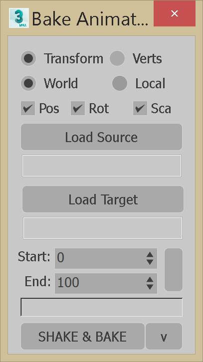

# Maxscript
Sample Maxscripts for Artist workflow tools

## Animation Baker

Use to match keyframes (baked) from one object to another on a given time range 
Also facilitates creating point cache

## Batch Render Tools
Script located in [C-Sharp](https://github.com/carlosbreban/C-Sharp) repo.

Used to save, load or clear entries in the Batch Renderer. File output can be either **.csv**  or **.ms**

